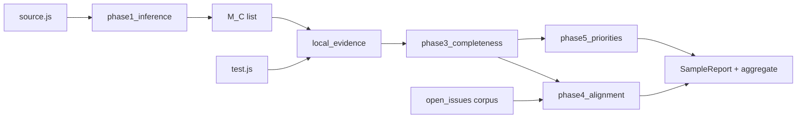

# UI Component MR Completeness Framework — Development Guide

**Audience:** contributors, artifact evaluators, and paper replicators  
**Requirements baseline:** [`require.md`](../require.md)  
**ICSE-oriented defaults:** LLM-primary Phase 1, frozen provenance, heuristic ablation only

---

## 1. Document map

| Document | Purpose |
|----------|---------|
| [`require.md`](../require.md) | Research scope, five phases, RQ1–RQ3, dataset |
| **This file** | Architecture, modules, APIs, extension points, replication |
| [`analysis/open_issues/2026-0510-README.md`](../analysis/open_issues/2026-0510-README.md) | External anchor corpus **I** (Phase 4) |
| [`README.md`](../README.md) | Quick start commands |

---

## 2. System overview

### 2.1 Problem and outputs

For each evaluation sample **(C, T, meta)**:

- **C** — `data/test/.../source.js`
- **T** — `data/test/.../test.js` (may be empty)
- **meta** — `library`, `category`, `component_name`, `sample_id`

The pipeline produces a **SampleReport** (JSON) containing:

| Block | Phase | Content |
|-------|-------|---------|
| `metamorphic_relations` | 1 | **M(C)** — list of MRs |
| `mr_coverage` | 2 | **O(T, m)** per MR (`evidence_*`, `touched`, `hybrid_*`) |
| `completeness` | 3 | Touch rate, strict coverage rate, gaps |
| `blind_spots` | 3 | `miss_at_uncov`, top blind `relation_type`s |
| `issue_pressure` + `alignment_notes` | 4–5 | Open-bug pressure, insufficient-attention narrative |
| `test_priorities` | 5 | Component × MR type × reason |
| `provenance` | all | Frozen versions for replication (ICSE artifact) |

Batch runs additionally write **aggregate** tables for RQ1–RQ3 under `output/aggregate/`.

### 2.2 Five-phase flow (implementation mapping)



**Single entry points**

- `mr_framework.pipeline.analyze_sample(meta, ...)`
- `mr_framework.pipeline.run_batch(...)`
- CLI: `backend/scripts/run_sample.py`, `run_batch.py`

---

## 3. Repository layout

```text
MRs_Component_test/
├── require.md                 # Product / research requirements
├── docs/
│   └── DEVELOPMENT.md         # This guide
├── data/test/                 # 190 samples (frozen C/T)
├── analysis/open_issues/      # Corpus I + pressure table (Phase 4)
├── backend/
│   ├── requirements.txt
│   ├── mr_framework/          # Core library
│   │   ├── taxonomy.py        # 5 categories, 42 relation_types (encoding framework)
│   │   ├── versioning.py      # Prompt/taxonomy fingerprints, run_config
│   │   ├── samples.py           # Parse sample dirs, read C/T
│   │   ├── models.py            # Dataclasses + report schema
│   │   ├── phase1_inference.py  # M(C): LLM primary, heuristic ablation
│   │   ├── local_evidence.py    # O(T,m) alignment
│   │   ├── phase2_alignment.py  # Thin wrapper over local_evidence
│   │   ├── phase3_completeness.py
│   │   ├── phase4_alignment.py  # Exp1, Exp2, VAL (RQ3)
│   │   ├── phase5_priorities.py
│   │   └── pipeline.py          # Orchestration
│   └── scripts/
│       ├── run_sample.py
│       ├── run_batch.py
│       └── collect_open_issues.py
└── output/                    # Generated (gitignored)
    ├── reports/
    ├── aggregate/
    └── run_config.json        # Written each batch
```

---

## 4. Core concepts (developer contract)

### 4.1 Symbols (from requirements)

| Symbol | Code representation |
|--------|---------------------|
| **M(C)** | `report.metamorphic_relations[]` |
| **m** | One MR with `id`, `relation_type`, `type_category` |
| **O(T, m)** | One row in `report.mr_coverage[]` |
| **V** | `version_snapshot` + open_issues `open_issues_summary.json` |
| **I** | `analysis/open_issues/open_issues_five_repos.json` |
| **issue_pressure(c)** | `report.issue_pressure` (from `open_issue_pressure_by_component.json`) |

### 4.2 Taxonomy vs MR instances

**Do not conflate:**

- **Taxonomy** (`taxonomy.py`) — stable **encoding framework** (42 `relation_type` labels under 5 `type_category` keys). Used to **classify** MRs and aggregate RQ2; not synonymous with “all MRs a component must satisfy.”
- **M(C)** — **component-specific** MR list from Phase 1 (LLM or ablation). Count is **not** padded to fill the taxonomy.

### 4.3 Touch vs strict coverage

| Metric | Field | Rule (summary) |
|--------|-------|----------------|
| **Touch** | `evidence_touch` / `touched` | MR tokens align with test block tokens (soft_sim ≥ threshold) or weak-touch floor when tests exist |
| **Strict coverage** | `evidence_covered` | Touch hits appear **near** an assertion marker (`expect(`, `assert`, `should`, …) in **T** only |
| **Hybrid touch** | `hybrid_touched` | `evidence_covered` OR `evidence_touch_score` ≥ 0.5 |

Paper-facing primary metric for “completeness”: **`coverage_rate`** (strict). Report **`touch_rate`** separately.

### 4.4 RQ3 wording

Phase 4 implements **alignment / co-occurrence** only. Do not add fields or docs implying issue count **predicts** future defects.

---

## 5. Phase-by-phase implementation

### Phase 1 — MR inference (`phase1_inference.py`)

**Primary mode (ICSE main):** `mode="llm"`

- Prompts: `versioning.build_mr_inference_system_prompt()` + `build_mr_inference_user_prompt()`
- Prompt version: `MR_INFERENCE_PROMPT_VERSION` (e.g. `icse-phase1-v1`)
- Model: `LLM_MODEL_NAME` / `OPENAI_MODEL` env, default `gpt-4o-mini`
- Temperature: `DEFAULT_LLM_TEMPERATURE` (0.2)
- Output: `MrInferenceResult` with `provenance_dict()`

**Ablation mode:** `mode="heuristic_ablation"`

- Pattern hits from `CODE_PATTERN_HINTS` only
- **No** “fill taxonomy to N MRs”
- If no patterns: single `type_equivalence` placeholder (document as ablation only)

**Failure policy**

| Flag | Behavior |
|------|----------|
| Default | `RuntimeError` if LLM fails (forces explicit fallback choice) |
| `--allow-heuristic-fallback` | LLM fail → heuristic ablation + `llm_fallback_reason` in provenance |

**Extend Phase 1**

1. Bump `MR_INFERENCE_PROMPT_VERSION` in `versioning.py` when prompt text changes.
2. Bump `TAXONOMY_VERSION` in `taxonomy.py` when `relation_type` set changes.
3. Add optional context (API docs) by extending `build_mr_inference_user_prompt` — keep fingerprint logic updated.

### Phase 2 — Alignment (`local_evidence.py`, `phase2_alignment.py`)

`apply_local_evidence_mr_coverage(...)` mutates `mr_coverage` rows in place.

**Parameters**

- `tests` — real **T** (assertions only count here for strict cover)
- `code_alignment_fallback` — **C** when T empty (touch only, never strict cover)

**Extend Phase 2**

- Tune thresholds in `_best_alignment_for_row` (`soft_sim`, activity floor).
- Add alternative aligner (e.g. LLM coverage pass) as separate function; merge in `phase2_alignment` with explicit `alignment_method` in provenance.

### Phase 3 — Metrics (`phase3_completeness.py`)

- `compute_completeness(mr_coverage)` → rates and counts
- `diagnose_blind_spots(mr_coverage)` → `miss_at_uncov`, `touched_not_covered`, top types

**Blind spot kinds**

- `miss_at_uncov` — not touched and not strictly covered
- `touched_not_covered` — touched but not strictly covered (RQ2 focus)

### Phase 4 — Open issues (`phase4_alignment.py`)

**Inputs**

- Per-sample reports (completeness + blind spots)
- `analysis/open_issues/open_issues_five_repos.json`
- `open_issue_pressure_by_component.json`

**Outputs**

- `run_exp1` — pressure vs touch_rate (Pearson + high-pressure/low-complete subset)
- `run_exp2` — issue topic keywords vs blind `relation_type` overlap
- `build_alignment_report` → `alignment_val.json`

**Refresh corpus:** `scripts/collect_open_issues.py` (needs `GITHUB_TOKEN` in repo-root `.env`).

### Phase 5 — Priorities (`phase5_priorities.py`)

`build_test_priorities` ranks uncovered / touched-not-covered MRs, boosted by `issue_pressure`.

---

## 6. Provenance and replication (ICSE artifact)

Every `SampleReport` should include `provenance`:

```json
{
  "framework_version": "0.2.0",
  "mr_inference_mode": "llm",
  "llm_model": "gpt-4o-mini",
  "llm_temperature": 0.2,
  "prompt_version": "icse-phase1-v1",
  "prompt_fingerprint": "16-hex-chars",
  "taxonomy_version": "1.0.0",
  "taxonomy_fingerprint": "16-hex-chars",
  "llm_fallback_reason": null
}
```

Each batch writes `output/run_config.json` via `versioning.write_run_config` (frozen defaults + CLI overrides).

**Replicator checklist**

1. Python 3.10+, `pip install -r backend/requirements.txt`
2. Set `OPENAI_API_KEY` (+ optional `OPENAI_BASE_URL`, `LLM_MODEL_NAME`)
3. `cd backend && python3 scripts/run_batch.py` (see §7)
4. Archive: git commit hash, `run_config.json`, `taxonomy.py` hash, open_issues summary timestamp

---

## 7. CLI reference

### Single sample

```bash
cd backend
export OPENAI_API_KEY=sk-...

# Default: LLM inference
python3 scripts/run_sample.py 1-mui-material-Inputs-Autocomplete

# Ablation (no API)
python3 scripts/run_sample.py 1-mui-material-Inputs-Autocomplete --heuristic-ablation

# LLM with explicit fallback
python3 scripts/run_sample.py 1-mui-material-Inputs-Autocomplete --allow-heuristic-fallback
```

### Batch

```bash
python3 scripts/run_batch.py --limit 5          # smoke
python3 scripts/run_batch.py                    # full 190
python3 scripts/run_batch.py --library mui-material
python3 scripts/run_batch.py --heuristic-ablation   # ablation study only
```

### Open issues

```bash
python3 scripts/collect_open_issues.py
python3 scripts/collect_open_issues.py --library ant-design --max-pages 30
```

---

## 8. Report schema (SampleReport)

| Field | Type | Description |
|-------|------|-------------|
| `meta` | object | `sample_id`, `library`, `category`, `component_name`, paths |
| `version_snapshot` | string | Run/batch UTC or corpus tag |
| `model` | string | LLM model id or `heuristic_ablation` |
| `provenance` | object | §6 |
| `metamorphic_relations[]` | array | Phase 1 MRs |
| `mr_coverage[]` | array | Phase 2 per-MR evidence |
| `completeness` | object | Phase 3 aggregates |
| `blind_spots` | object | Phase 3 diagnostics |
| `test_priorities[]` | array | Phase 5 ranked list |
| `issue_pressure` | int | Open bugs mapped to component |
| `generated_at` | ISO UTC | Report timestamp |

**`mr_coverage` row (minimum)**

```json
{
  "mr_id": "mr:…",
  "relation_type": "null_handling",
  "type_category": "input_property_relations",
  "evidence_touch": true,
  "evidence_touch_score": 0.42,
  "evidence_touch_hits": ["null", "empty"],
  "evidence_covered": false,
  "hybrid_touched": true,
  "touched": true,
  "covered": false
}
```

---

## 9. Extending the framework

### 9.1 Add a UI library

1. Add samples under `data/test/{id}-{library}-…`
2. Update `samples.LIBRARIES` if the library slug is new
3. Add repo entry in `scripts/github_corpus_lib.REPOS` for issue collection
4. Re-run `collect_open_issues.py`

### 9.2 Add a `relation_type`

1. Add entry under correct category in `taxonomy.py`
2. Bump `TAXONOMY_VERSION` (semver)
3. Update LLM prompt allow-list (automatic via `RELATION_TYPE_CATEGORIES`)
4. Optionally add `CODE_PATTERN_HINTS` for ablation
5. Re-run batch; compare RQ2 distribution shift

### 9.3 Add a pipeline phase

1. Implement `phaseN_*.py` with pure functions (no CLI in module)
2. Call from `pipeline.analyze_sample`
3. Extend `SampleReport` + CSV export columns
4. Document metric in this file and `require.md` trace table

---

## 10. Development milestones (aligned with requirements)

| Milestone | Deliverable | Modules |
|-----------|-------------|---------|
| **M1** | Single-sample report | P1–P3, P5, `run_sample.py` |
| **M2** | 190-sample batch + RQ1/RQ2 CSV | `run_batch.py`, `aggregate_batch` |
| **M3** | Corpus I + Exp1/2 + VAL | `collect_open_issues.py`, `phase4_alignment.py` |
| **M4** | Qualitative cases + paper tables | Manual curation from `output/reports/` |

### Planned (post-M3, ICSE hardening)

| ID | Task | Priority |
|----|------|----------|
| P1 | Human annotation export + κ evaluation | P0 research |
| P1 | Baselines (LOC coverage, #tests vs MR metrics) | P1 paper |
| P2 | `replicate.sh` one-command artifact | P1 AE |
| P2 | Regression tests on golden samples | P2 engineering |

---

## 11. Testing and quality

**Smoke (no API)**

```bash
cd backend
python3 scripts/run_batch.py --limit 3 --heuristic-ablation
```

**Smoke (with API)**

```bash
export OPENAI_API_KEY=...
python3 scripts/run_sample.py 1-mui-material-Inputs-Autocomplete
```

**Sanity checks**

- `completeness.total_mrs` == `len(metamorphic_relations)`
- `coverage_rate` ≤ `touch_rate` typically (not always if LLM `covered` added later)
- `provenance.mr_inference_mode` matches CLI mode
- Ablation reports must not be tagged `mode=llm` in paper tables

---

## 12. Environment variables

| Variable | Used by | Purpose |
|----------|---------|---------|
| `OPENAI_API_KEY` | Phase 1 LLM | Required for default path |
| `OPENAI_BASE_URL` | Phase 1 | Compatible APIs (DeepSeek, etc.) |
| `LLM_MODEL_NAME` / `OPENAI_MODEL` | Phase 1 | Override default model |
| `GITHUB_TOKEN` | `collect_open_issues` | Higher rate limits |

Example `.env` at repo root (not committed):

```env
OPENAI_API_KEY=sk-...
LLM_MODEL_NAME=gpt-4o-mini
GITHUB_TOKEN=ghp_...
```

---

## 13. Coding conventions

- **Phases are modules**, not microservices — keep functions pure where possible.
- **No silent taxonomy padding** in main experiments.
- **Version bumps** on any change that affects metrics comparability.
- **English** in code/comments; paper can use bilingual `reason_i18n` when added.
- Prefer extending `provenance` over ad-hoc top-level report fields.

---

## 14. Requirement traceability

| Req ID | Capability | Implementation |
|--------|------------|----------------|
| G1 | Structured report | `SampleReport.to_dict()` → `output/reports/` |
| G2 | Stable metrics | `phase3_completeness` + documented touch/cover rules |
| G3 | RQ1–RQ3 | `aggregate/batch_summary.json`, `alignment_val.json` |
| G4 | Priorities | `phase5_priorities`, `test_priorities.csv` |
| P4-* | Open issues | `analysis/open_issues/`, `phase4_alignment` |
| NF-1 | Reproducible | `versioning.py`, `run_config.json`, fingerprints |

---

## 15. FAQ (reviewer-oriented)

**Why a fixed taxonomy instead of learning types from data?**  
It is an **analysis framework** (like coding guidelines), not the output of MR discovery. MR discovery is Phase 1 per component.

**Why LLM for M(C) but heuristics for alignment?**  
LLM captures semantic MRs from **C**; alignment uses **auditable** test-token evidence for O(T, m). LLM coverage can be added as a sensitivity pass.

**Can I run without OpenAI?**  
Only for **ablation** (`--heuristic-ablation`) or `--allow-heuristic-fallback`. Main ICSE numbers should use frozen LLM settings.

---

*Last updated with framework version `0.2.0` / taxonomy `1.0.0` / prompt `icse-phase1-v1`.*
