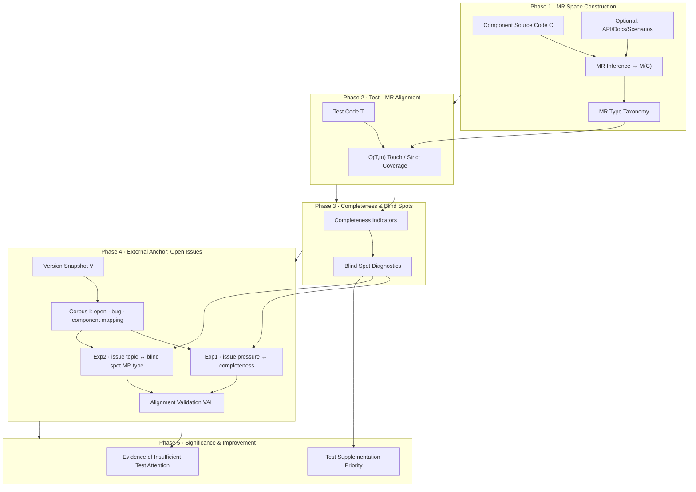

# UI Component MR Completeness Framework — Development Requirements Specification

**Scope:** Framework capabilities are defined based on the research topics and method flowchart; not bound to any particular technology stack. However, in Phase 4, **open issues (current version, open)** serve as the sole main external anchor.

**Supporting Documentation:**
- Open Issues corpus definition and fields (reference implementation): [`../analysis/open_issues/README.md`](../analysis/open_issues/README.md)

---

## 1. Project and Framework Purpose

### 1.1 Problem

In component library development, testing often emphasizes "runnability" but lacks systematic coverage of **behavioral relations**. Traditional coverage metrics fail to reflect whether behavior remains correct when inputs/states/interactions change.

### 1.2 Framework Principles

| Step | Principle |
|------|----------|
| 1 | Using LLM to infer the set of required metamorphic relations **M(C)** from component source code **C** |
| 2 | If test **T** covers **M(C)** with verifiable evidence, the tests are more robust and better at exposing latent defects |
| 3 | Measure completeness and identify **blind spots** to reveal insufficient attention in testing |
| 4 | Use **open, component-relevant bug issues** from the **version snapshot V** as external anchors and align them in a cross-sectional view with completeness/blind spots to demonstrate practical value |

### 1.3 Framework Goals

| ID | Goal |
|----|------|
| **G1** | Output structured **MR completeness reports** for any sample `(C, T, meta)` |
| **G2** | Indicator definitions are stable, reproducible, and documentable in methodology |
| **G3** | Able to answer RQ1–RQ3 (see §2.1), supporting the claim of "insufficient attention to MR space in testing" and aligning with open issues |
| **G4** | Output **test supplementation priorities** (component × MR type × reason) |

### 1.4 Research Questions (Corresponding to Five Phases)

| RQ | Summary | Main Phases |
|----|---------|-------------|
| **RQ1** | Across samples from five libraries, how low is the coverage/strict coverage rate of tests for **M(C)**? Differences between libraries and categories? | Phase 1–3 |
| **RQ2** | Which **MR types** are more likely to be blind spots (untouched) or "touched but not covered"? | Phase 3 |
| **RQ3** | Do component-related **open bug issues** correspond to MR completeness gaps and blind spot types? | Phase 4 |

**Expression Constraint:** RQ3 uses **co-occurrence/alignment**, not asserting that open issue quantity can "predict" future defects.

---

## 2. Method Flow (To Be Implemented in Five Phases)

The flowchart below is the **sole** phase segmentation reference.

---

## 3. Core Concepts (Logical Data)

| Symbol / Object | Meaning |
|-----------------|---------|
| **C** | Component implementation source code (corresponding to snapshot **V**) |
| **T** | Associated test source code (may be empty, corresponds to **V**) |
| **M(C)** | List of MRs `{ m₁…mₙ }` |
| **O(T, m)** | Verifiable evidence of touch/strict coverage, etc. |
| **Completeness** | Aggregation on M(C) (touch rate, strict coverage rate, etc.) |
| **Blind Spot** | E.g., miss@uncov, rate of "touched but not covered", etc. |
| **V** | **Current version** corresponding to the corpus and MR analysis (tag/commit or UTC timestamp, must be recorded) |
| **I** | Subset of **open** issues for the five libraries at time **V** (see §5.4 for valid issues) |
| **issue_pressure(c)** | Count or weighted pressure of open bugs mapped to component *c* |
| **VAL** | Exp1+Exp2 aggregation, answering RQ3 |

---

#### Projects:
- material-ui (mui-material)
  - https://github.com/mui/material-ui
- ant design (ant-design)
  - https://github.com/ant-design/ant-design
- element-plus (element-plus)
  - https://github.com/element-plus/element-plus 
- mui/base-ui (mui-base-ui)
  - https://github.com/mui/base-ui
- heroui
  - https://github.com/heroui-inc/heroui

##### Dataset:
- data/test is a dataset of 190 UI component samples organized by ID-library-category-component name; each sample is a pair: source.js (implementation) + test.js (tests), used for MR completeness analysis.

- Each component corresponds to a subdirectory under data/test/, named as: {NumericalID}-{Library}-{Category}-{ComponentName}

Example: 1-mui-material-Inputs-Autocomplete refers to the Autocomplete component under Inputs in the mui-material library, meaning:

| Field | Value |
|-------|-------|
| Numerical ID | 1 | Globally unique |
| Library | mui-material | Library name |
| Category | Inputs | Component category |
| Component Name | Autocomplete | Component name |

- Each component directory typically contains two main files, corresponding to Framework's Source C and Test T:
  - source.js: The component implementation (C), extracted/trimmed from the open-source library
  - test.js: The tests for that component (T), mostly using React Testing Library